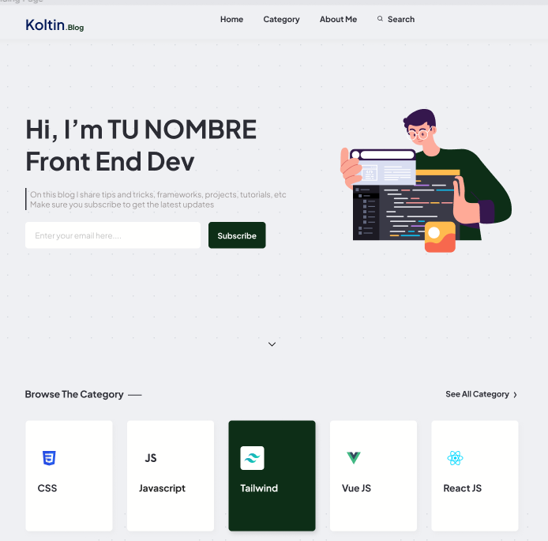
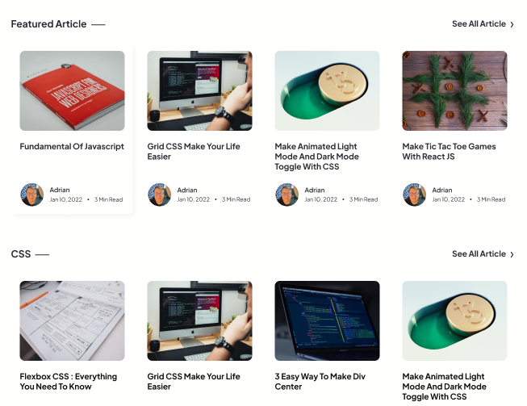
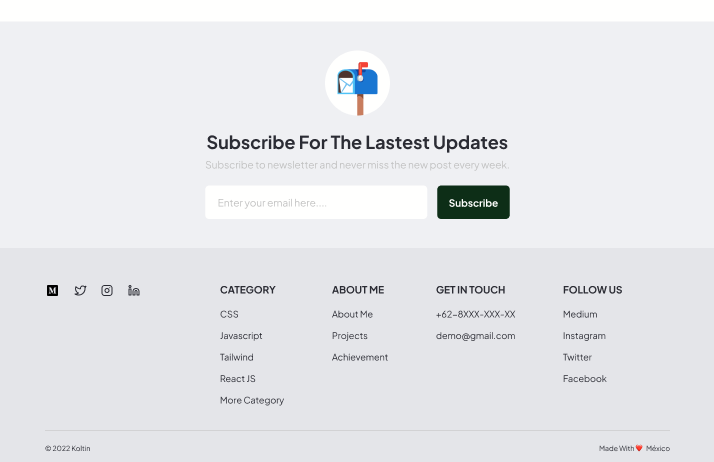
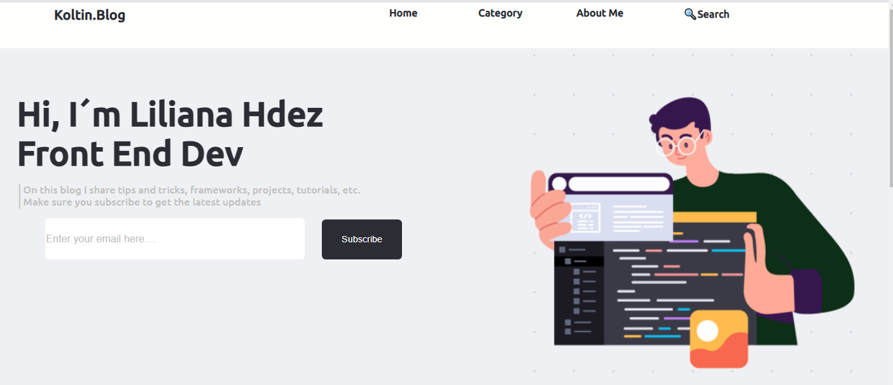
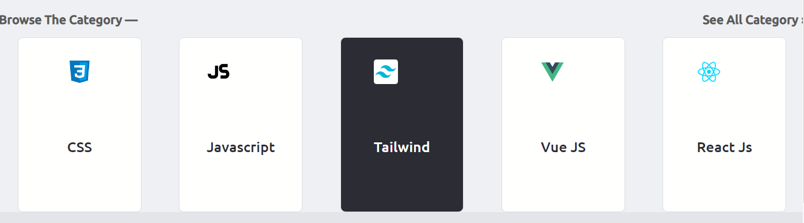
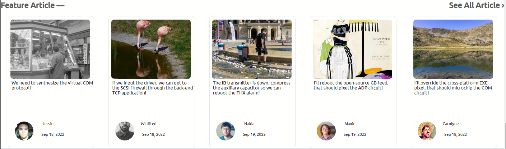
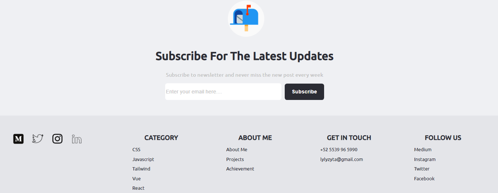
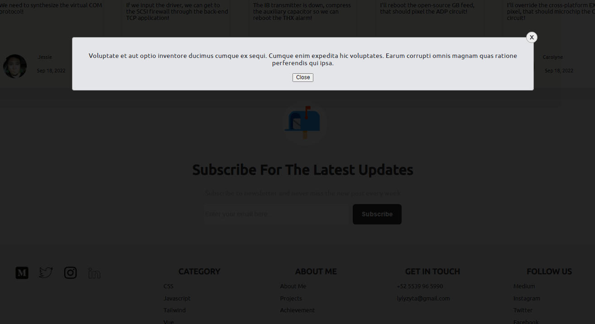

# Koltin prueba técnica desarrolador frontend

## Índice

* [1. Koltin-Empresa](#1-Koltin-Empresa)
* [2. Requisitos prueba técnica desarrollador frontend](#2-Requisitos-prueba-técnica-desarrollador-frontend)
* [3. Desarrollo de la prueba técnica](#3-Desarrollo-de-la-prueba-técnica)
* [4. Conclusión](#4-Conclusión)

***
## 1. Koltin-Empresa

El presente proyecto a sido realizado para llevar a cabo una prueba técnica para la empres Koltin.

Koltin es una empresa cuya misión es : 

"Promover un estilo de vida saludable, devolverle la dignidad a la vejez. Nosotros creemos que las personas son más que números y evaluaciones de riesgos.
Buscamos entender más a las grandes personas y darles las herramientas para vivir una vida más completa y enriquecedora."

Página web https://www.koltin.mx/

## 2. Requisitos prueba técnica desarrollador frontend

Utilice este archivo Figma para ver los estados de los botones, los colores y el diseño responsivo. Debe asegurarse de completar la prueba para imitar el diseño como se ve.

La página de Post individual se deja para que el dev la diseñe y desarrolle.

Koltin Blog API
Para listar los Blogs tienes que usar los access point de la API

Base URL https://6328f6acd2c97d8c525f8f80.mockapi.io/api/v1/

Metodo	Url	Código	Respuesta
GET	/blogs	200	Array
GET	/blogs/:id	200	Blog

PAGINATION
Agregar los siguientes parametros en la peticiones GET:

/blogs?page=1&limit=10
/blogs?p=1&l=10
Funcionalidad
Listar los blogs paginados, 5 post por página
Al dar click en la imagen del listado de blog, se tiene que mostrar el contenido del post individual
Tech Stack
ReactJS, VueJS, Vanilla Javascript
CSS
Bonus
Que la maqueta sea responsiva
Describir en un readme como ejecutar el proyecto
Mostrar demo online del proyecto
Escribir mensajes de commit claros y concisos

### 3. Desarrollo de la prueba técnica

La prueba la lleve a cabo con React, durante el Bootcamp de Laboratoria desarrolle 1 proyecto con dicha tecnología, lo cual me permitió desarrollar el presente reto.

Para la parte de maquetación use siguientes tecnologías:

CSS
REACT JS

Para la parte de la funcionalidad usé el método GET con REACT para poder obtener y "pintar" la información compartida en el access point de la API

Base URL https://6328f6acd2c97d8c525f8f80.mockapi.io/api/v1/

A continuación muestro el resultado final de la presente prueba

### 4. Conclusión
Agradezco la oportunidad por presentar dicha prueba, fue un proyecto lleno de aprendizajes.

Gracias.

Liliana Hdez Castelán
